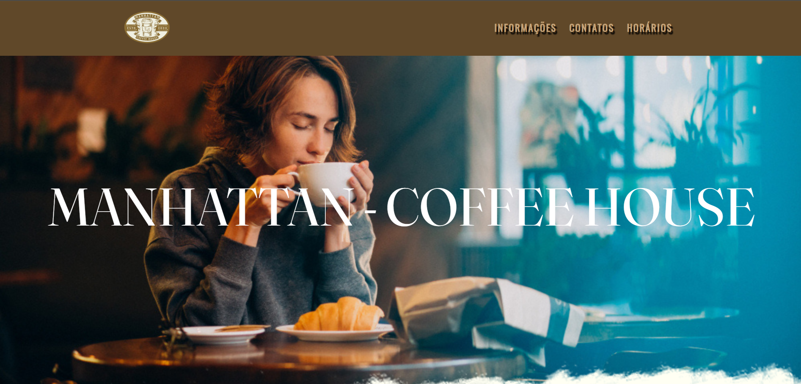
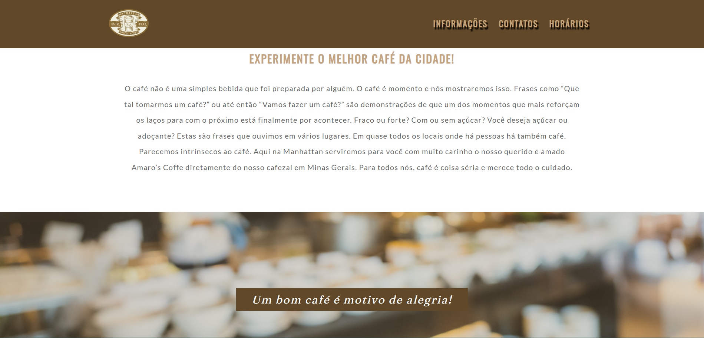
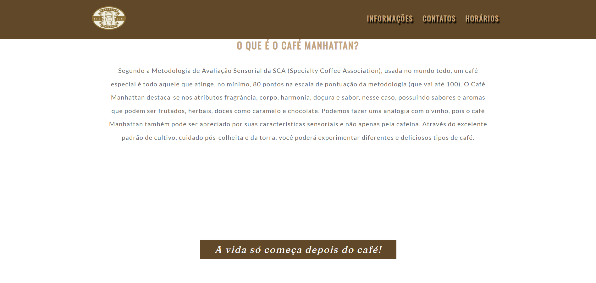
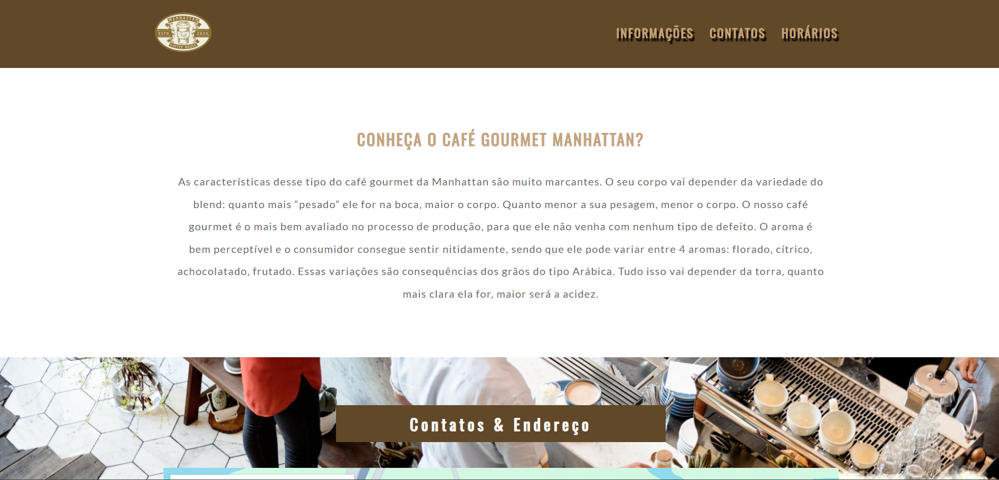
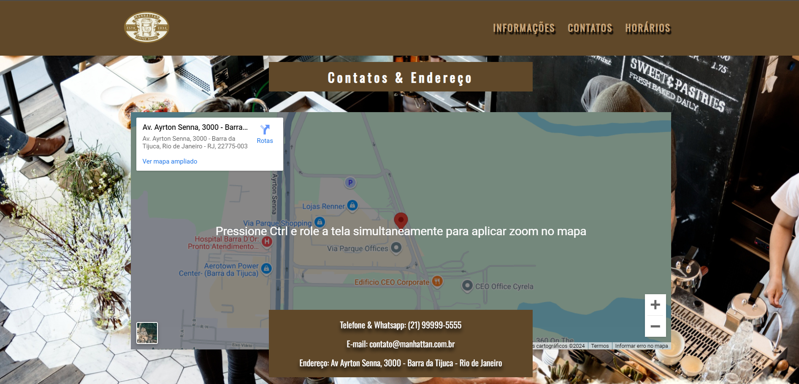
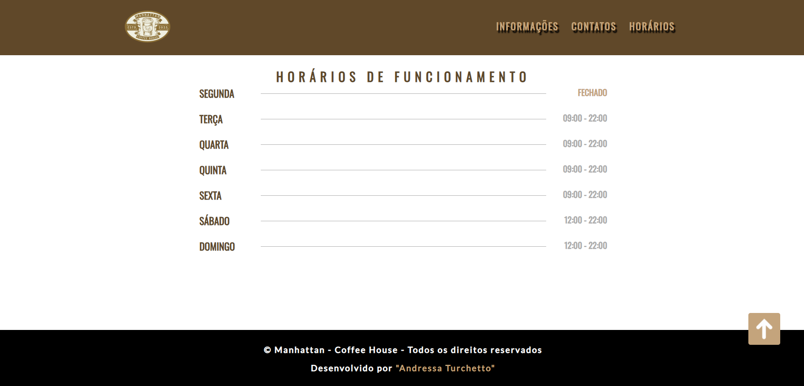

# Cafeteria MANHATTAN 

O projeto possui um design que deve atrair os clientes da cafeteria. As seções estão claramente definidas e a navegação é intuitiva. Com algumas melhorias focadas em SEO, acessibilidade e responsividade, você pode aprimorar ainda mais a experiência do usuário e a visibilidade online do "Manhattan Coffee House".

## Clone o repositório:

git clone https://github.com/AndressaTurchetto/coffe-shop-manhattan.git

